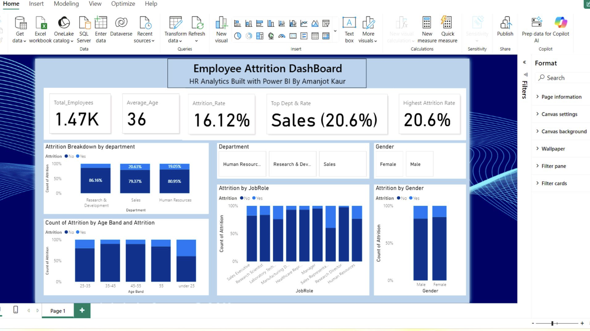
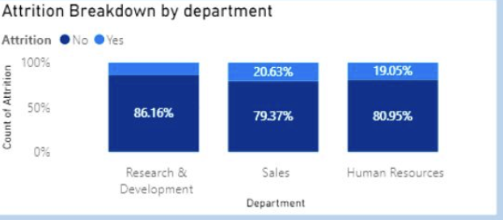
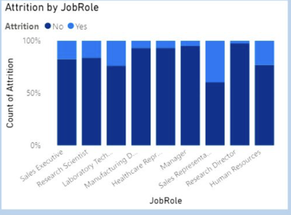

# HR Attrition Analytics — SQL & Power BI Project

## 👋 About This Project

This project explores employee attrition using SQL and Power BI with the goal of understanding **why employees leave** and what actions a company could take to improve retention.

I built the complete analytics pipeline myself — starting from raw HR data, cleaning and transforming it in SQL, designing a proper data model, calculating business KPIs, and finally creating an interactive executive dashboard in Power BI.

I wanted this project to reflect the real workflow of a data analyst supporting HR teams with data-driven decisions.

---

## 🧩 Business Problems I Wanted to Answer

- What is the overall employee attrition rate?
- Which departments have the highest employee turnover?
- Which job roles are most at risk?
- Does overtime significantly increase attrition?
- How does employee tenure impact attrition?
- Are there specific high-risk employee profiles?

---

## 🏗️ Data Pipeline Design

Each layer was designed deliberately so that business questions could be answered cleanly and reliably, similar to how data pipelines are structured in real analytics teams.

**Raw Data → Cleaning & Feature Engineering → Dimensional Modeling → KPI Analysis**

## 🚀 How to Run This Project (MySQL)

### 1. Create the database
Create a schema in MySQL called:hr_attrition

### 2. Load raw data
Run:sql/01_raw.sql

> If using `LOAD DATA LOCAL INFILE`, update the CSV path inside the file to match your local machine.

### 3. Clean and prepare data (staging)
sql/02_staging.sql

### 4. Build dimension tables
sql/03_dimensions.sql

### 5. Build fact table
sql/04_fact.sql

### 6. Generate KPIs
sql/05_kpis.sql

### 7. Advanced analysis
sql/06_advanced_insights.sql

---

## 📊 Key Results & Business Findings

| Metric | Result |
|------|------|
| Overall Attrition Rate | 16.12% |
| Highest-Risk Department | Sales (20.63%) |
| Highest-Risk Job Role | Sales Representative (39.76%) |
| Attrition with Overtime | 30.53% |
| Attrition without Overtime | 10.44% |
| Highest-Risk Tenure Group | 0–1 years (34.88%) |

### What This Means

- Employee turnover is heavily concentrated in Sales, especially Sales Representatives.
- Overtime is a major risk factor and triples the likelihood of attrition.
- New hires are the most vulnerable group and require better onboarding and support.

---

## 📊 Executive Dashboard

### Executive Overview

### Attrition by Department

### Attrition by Job Role

---

## 🧮 Tools & Technologies

- MySQL  
- SQL  
- Power BI  

---

## 📁 Project Structure

data/ → Raw dataset
sql/ → SQL transformation layers
powerbi/ → Dashboard and screenshots
documentation/ → Project notes

---

## 🎯 Why I Built This

I created this project to strengthen my data analytics skills and to demonstrate how data can be transformed into business-ready insights.  

